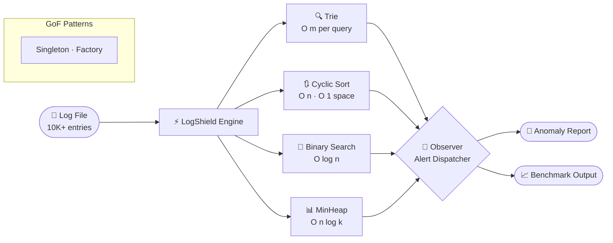

<div align="center">


<br/>

[](https://www.linkedin.com/in/virochan-v)
[](mailto:virochan.tech@gmail.com)
[](https://github.com/virochan-v)
[](https://www.hackerrank.com/profile/virochan_v)
[](https://leetcode.com/u/virochan_v/)

</div>

---

## `$ ./boot --profile virochan-v`

<div align="center">

</div>

---

## `$ cat my_story.log`

Most developers reach for a framework first. I reach for a whiteboard and ask *why.* That instinct turned one question — *what does linear search actually cost at 10,000 entries?* — into a **371× benchmark**: Binary Search completing in 7ms what a linear scan took 2,847ms to finish. That proof became **LogShield**, which cleared **HackWithInfy 2026 at the L2 Competency level**, placing me among the top tier of national candidates. The same discipline — understand the problem before touching the keyboard — won national startup stages at **IIFT Kakinada (1st Prize)** and **NIT Tiruchirappalli (2nd Runner-Up)**, produced a paper at the **13th International Biltek Congress**, and earned 4 Oracle cloud certifications. I'm now applying it to Spring Boot: not because it's in demand, but because understanding *why* REST, *why* IoC, *why* dependency injection — that's the only way I know how to build things that last.

> [!TIP]
> 💡 **Philosophy:** Every business problem is an algorithm problem in disguise. I engineer solutions from data structures up — not frameworks down.

---

## `$ cat about_me.log`

```yaml
name        : Virochan V
college     : R.M.D. Engineering College — B.Tech CSBS | CGPA: 7.94 / 10.0
graduation  : May 2027  |  location: Tamil Nadu, India
identity    : Logic-First Problem Solver
target      : Software Engineer · Java Backend · Full-Stack
superpower  : Turning O(n) into O(log n) — and knowing exactly why it matters
```

---

## `$ cat system.status`

<table>
<tr>
<td width="50%" valign="top">

### 🔨 Currently Building
- [ ] **LogShield v2** — CLI → Spring Boot REST API *(active)*
- [ ] **Microsoft Azure** — Cloud architecture fundamentals *(learning)*

</td>
<td width="50%" valign="top">

### ✅ Certifications

<details>
<summary><b>🏅 View All 8 — with verification links</b></summary>
<br/>

| | Certification | Verify |
|:---:|---|:---:|
| 🏅 | OCI Multicloud Architect Professional | [Credly](https://www.credly.com) |
| 🏅 | Oracle AI Foundations Associate | [Credly](https://www.credly.com) |
| 🏅 | OCI Generative AI Professional | [Credly](https://www.credly.com) |
| 🏅 | OCI Foundations Associate | [Credly](https://www.credly.com) |
| 📚 | NPTEL — Human Computer Interaction · **Elite 96%** | [NPTEL](https://nptel.ac.in) |
| 📚 | NPTEL — Introduction to Machine Learning | [NPTEL](https://nptel.ac.in) |
| 📚 | NPTEL — Google Cloud Computing Foundations | [NPTEL](https://nptel.ac.in) |
| 📝 | TOEFL ITP 603/677 — C1 Listening & Reading | — |

</details>


</td>
</tr>
</table>

---

## `$ ls tech_stack/`

<div align="center">

</div>

<br/>

<div align="center">

| 💻 Languages | 🛠️ Tools & IDEs | ☁️ Cloud & OS | 📐 CS Concepts |
|:---:|:---:|:---:|:---:|
| `Java` — Primary | `Git` / `GitHub` | `Microsoft Azure` | Data Structures & Algorithms |
| `SQL` — Basics | `IntelliJ IDEA` | `Linux` CLI | Design Patterns (GoF) |
| | `Postman` | | SOLID Principles |

</div>

---

## `$ cat projects/LogShield.md`

<div align="center">

### 🛡️ LogShield — Real-Time Log Anomaly Detector
*A CLI-based log analysis engine in Core Java. Every design decision justified by algorithmic complexity — not convenience.*

</div>

| Layer | Structure | Purpose | Complexity |
|---|---|---|---|
| 🔍 Pattern Indexing | `Trie` | Prefix-based anomaly lookup | $O(m)$ per query |
| 📊 Severity Ranking | `Cyclic Sort` | Minimal memory writes | $O(n)$ · $O(1)$ space |
| 📂 Log Retrieval | `Binary Search` | Sub-linear lookup at scale | $O(\log n)$ |
| 🏆 Top-K Alerts | `MinHeap` | Efficient anomaly ranking | $O(n \log k)$ |
| 🏗️ Architecture | `Singleton · Factory · Observer` | Resource mgmt & extensibility | — |

> [!NOTE]
> ⚡ **Benchmark:** Binary Search vs Linear Scan · 10,000 entries · `Linear: 2,847ms` → `Binary: 7ms` → **371× faster**

<details>
<summary><b>☕ The code behind 371× — click to expand</b></summary>
<br/>

```java
// LogShield — BinarySearchRetriever.java
// O(log n) vs O(n): same data, better algorithm — 371× the result

public int retrieve(List<LogEntry> sortedLogs, String targetPattern) {
    int lo = 0, hi = sortedLogs.size() - 1;

    while (lo <= hi) {
        int mid = lo + (hi - lo) / 2;           // avoids integer overflow
        int cmp = sortedLogs.get(mid)
                            .getPattern()
                            .compareTo(targetPattern);

        if (cmp == 0) return mid;                // O(log n) exit
        if (cmp < 0)  lo = mid + 1;
        else          hi = mid - 1;
    }
    return -1;
}
```

</details>

<details>
<summary><b>🔍 System Architecture Diagram</b></summary>
<br/>



</details>

<div align="center">

[](https://github.com/virochan-v/LogShield)


</div>

---

## `$ cat achievements.log`

<div align="center">

| | Achievement | Event | Year |
|:---:|---|---|:---:|
| 🥇 | **1st Prize** + ₹10,000 | Fuse: Start-up Hackathon — IIFT Kakinada | 2025 |
| 🥉 | **2nd Runner-Up** | PitchStorm — NIT Tiruchirappalli (National) | 2025 |
| ⚡ | **L2 Competency Qualifier** — Top-tier nationally | HackWithInfy 2026 | 2026 |
| 📄 | **International Paper Presenter** | 13th Biltek Congress — Quantum Computation | 2025 |
| 🧑‍💼 | **Organizing Committee** — "One Pitch" Lead | DEXTERO '26 National Tech Symposium | 2026 |

</div>

---

## `$ cat work.history`

**Software Developer Intern** · CODTECH IT SOLUTIONS PVT LTD · *Jul – Aug 2025*
- Developed and tested application modules using **Java** and web technologies
- Contributed to **API development** and backend business logic implementation

---

## `$ run github_stats --render`

<div align="center">

</div>

---

## `$ run leetcode_stats --user virochan_v`

<div align="center">

</div>

<br/>

<details>
<summary><b>📊 DSA Topics Mastered — click to expand</b></summary>
<br/>

| Category | Topics | Applied In |
|---|---|---|
| **Arrays & Strings** | Two Pointers · Sliding Window · Prefix Sum | LeetCode |
| **Searching** | Binary Search · Linear Scan | LogShield — **371× speedup benchmarked** |
| **Sorting** | Bubble · Selection · Insertion · **Cyclic Sort** | LogShield severity ranking |
| **Data Structures** | `Trie` · `MinHeap` · Stack · Queue | LogShield pattern indexing & top-K |
| **Design Patterns** | Singleton · Factory · Observer | LogShield architecture |
| **Foundations** | Recursion · Bit Manipulation · Math | LeetCode · HackerRank |

> ⚡ Every structure and pattern above has been applied in a real project — not just solved on paper.

</details>

---

## `$ tail -f activity.log`

<div align="center">

</div>

---

## `$ connect.init() --open-to-work`

> [!IMPORTANT]
> 🟢 **Open to Software Engineering · Backend · Java Full-Stack**
> Internships & Full-Time · Response within 24hrs · Full-time available May 2027

<div align="center">

<br/>

[](https://www.linkedin.com/in/virochan-v)
[](mailto:virochan.tech@gmail.com)
[](https://www.hackerrank.com/profile/virochan_v)
[](https://leetcode.com/u/virochan_v/)

<br/>


<br/>


</div>
