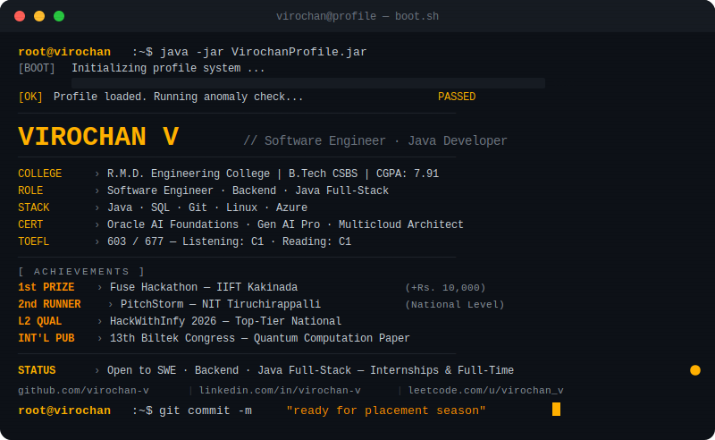
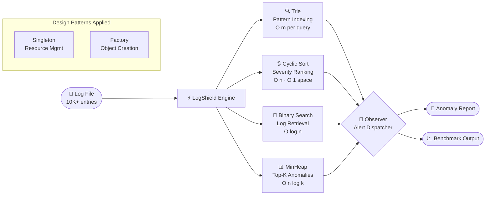

<div align="center">


<br/>

[](https://www.linkedin.com/in/virochan-v)
[](mailto:virochan.tech@gmail.com)
[](https://github.com/virochan-v)
[](https://www.hackerrank.com/profile/virochan_v)
[](https://leetcode.com/u/virochan_v/)


</div>

---

## `$ ./boot --profile virochan-v`

<div align="center">



</div>

---

## `$ cat about_me.log`

```yaml
name        : Virochan V
college     : R.M.D. Engineering College — B.Tech CSBS | CGPA: 7.91 / 10.0
graduation  : May 2027
location    : Tamil Nadu, India
target      : Software Engineer · Java Backend · Full-Stack
status      : 🟢 Actively seeking SWE roles & internships
philosophy  : "Every business problem is an algorithm problem in disguise."
```

> 🧠 I engineer solutions **from data structures up — not frameworks down.** I cleared the **L2 Competency bracket of HackWithInfy 2026**, placing among the top tier of national candidates, and have won on startup stages from **IIFT Kakinada to NIT Tiruchirappalli.** When I'm not optimizing time complexity, I'm presenting research at international conferences.

---

## `$ cat system.status`

<table>
<tr>
<td width="50%" valign="top">

### 🔨 Building Now
- **LogShield v2** — Spring Boot REST API (evolved from Core Java CLI)
- **Distributed Rate Limiter** — Redis + PostgreSQL + Docker Compose
- Sharpening **Linux CLI** and **Microsoft Azure** daily

</td>
<td width="50%" valign="top">

### ✅ Certifications

| | Certification | Date |
|:---:|---|:---:|
| 🏅 | OCI Multicloud Architect Professional | Oct 2025 |
| 🏅 | Oracle AI Foundations Associate | Aug 2025 |
| 🏅 | OCI Generative AI Professional | Oct 2025 |
| 🏅 | OCI Foundations Associate | Aug 2025 |
| 📚 | NPTEL — Human Computer Interaction · **Elite 96%** | 2026 |
| 📚 | NPTEL — Introduction to Machine Learning | 2025 |
| 📚 | NPTEL — Google Cloud Computing Foundations | 2024 |
| 📝 | TOEFL ITP 603/677 — C1 Listening & Reading | Mar 2026 |

</td>
</tr>
</table>

---

## `$ ls -la tech_stack/`

<div align="center">


</div>

<br/>

<div align="center">

| 💻 Languages | 🛠️ Tools & IDEs | ☁️ Cloud & OS | 📐 CS Concepts |
|:---:|:---:|:---:|:---:|
| `Java` — Primary | `Git` / `GitHub` | `Microsoft Azure` | Data Structures & Algorithms |
| `SQL` — Basics | `IntelliJ IDEA` | `Linux` CLI | Design Patterns (GoF) |
| | `Postman` | | SOLID Principles |

</div>

---

## `$ cat projects/LogShield.md`

<div align="center">

### 🛡️ LogShield — Real-Time Log Anomaly Detector

*A CLI-based log analysis engine in Core Java. Every design decision is justified by algorithmic complexity — not convenience.*

</div>

<table align="center">
<thead>
<tr>
<th>Layer</th>
<th>Structure / Pattern</th>
<th>Purpose</th>
<th>Complexity</th>
</tr>
</thead>
<tbody>
<tr>
<td>🔍 <b>Pattern Indexing</b></td>
<td><code>Trie</code></td>
<td>Prefix-based anomaly pattern lookup</td>
<td><code>O(m)</code> per query</td>
</tr>
<tr>
<td>📊 <b>Severity Ranking</b></td>
<td><code>Cyclic Sort</code></td>
<td>Minimal memory writes during reorder</td>
<td><code>O(n)</code> time · <code>O(1)</code> space</td>
</tr>
<tr>
<td>📂 <b>Log Retrieval</b></td>
<td><code>Binary Search</code></td>
<td>Sub-linear lookup at scale</td>
<td><code>O(log n)</code></td>
</tr>
<tr>
<td>🏆 <b>Top-K Alerts</b></td>
<td><code>MinHeap</code></td>
<td>Efficient worst-case anomaly ranking</td>
<td><code>O(n log k)</code></td>
</tr>
<tr>
<td>🏗️ <b>Architecture</b></td>
<td><code>Singleton · Factory · Observer</code></td>
<td>Resource management & extensibility</td>
<td>—</td>
</tr>
</tbody>
</table>

<br/>

<details>
<summary><b>🔍 Click to view LogShield Architecture Diagram</b></summary>
<br/>



</details>

<br/>

<div align="center">

[](https://github.com/virochan-v/LogShield)
[]()
[]()

</div>

---

## `$ cat achievements.log`

<div align="center">

| Rank | Achievement | Event | Year |
|:---:|---|---|:---:|
| 🥇 | **1st Prize** + ₹10,000 cash | Fuse: Start-up & Innovation Hackathon — IIFT Kakinada | 2025 |
| 🥉 | **2nd Runner-Up** | PitchStorm: Ultimate Startup Showdown — NIT Tiruchirappalli | 2025 |
| ⚡ | **L2 Competency Qualifier** — Top-tier nationally | HackWithInfy 2026 | 2026 |
| 📄 | **International Paper Presenter** | 13th Biltek Congress — Quantum Fault-Tolerant Computation | 2025 |
| 🧑‍💼 | **Organizing Committee** — "One Pitch" Event Lead | DEXTERO '26 National Tech Symposium | 2026 |

</div>

---

## `$ cat work.history`

**Software Developer Intern** · CODTECH IT SOLUTIONS PVT LTD · *Jul – Aug 2025*

- Developed and tested application modules using **Java** and web technologies
- Contributed to **API development** and backend business logic implementation

---

## `$ run github_stats --render`

<div align="center">


<br/>


<br/>


</div>

---

## `$ run leetcode_stats --user virochan_v`

<div align="center">


</div>

<br/>

<details>
<summary><b>📚 DSA Topics Mastered — Click to expand</b></summary>
<br/>

| Category | Topics Covered | Applied In |
|---|---|---|
| **Arrays & Strings** | Two Pointers · Sliding Window · Prefix Sum | LeetCode · LogShield |
| **Searching** | Binary Search · Linear Scan | LogShield — 371× speedup benchmarked |
| **Sorting** | Bubble · Selection · Insertion · **Cyclic Sort** | LogShield severity ranking |
| **Data Structures** | Trie · MinHeap · Stack · Queue | LogShield pattern indexing & top-K |
| **Design Patterns** | Singleton · Factory · Observer | LogShield architecture |
| **Foundations** | Recursion · Bit Manipulation · Patterns | LeetCode · SkillRack |

> ⚡ Benchmarked Binary Search vs Linear Scan on 10,000 log entries — achieved **~371× speedup**

</details>

---

## `$ tail -f activity.log`

<div align="center">


</div>

---

## `$ connect.init() --open-to-work`

<div align="center">

**🟢 Open to Software Engineering · Backend · Java Full-Stack — Internships & Full-Time**

<br/>

[](https://www.linkedin.com/in/virochan-v)
[](mailto:virochan.tech@gmail.com)
[](https://www.hackerrank.com/profile/virochan_v)
[](https://leetcode.com/u/virochan_v/)

<br/>


<br/>


</div>
