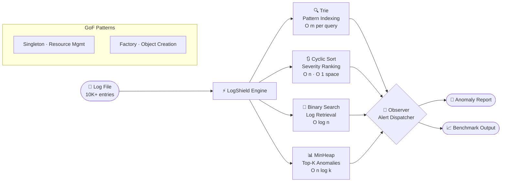

<div align="center">


<br/>

[](https://www.linkedin.com/in/virochan-v)
[](mailto:virochan.tech@gmail.com)
[](https://github.com/virochan-v)
[](https://www.hackerrank.com/profile/virochan_v)
[](https://leetcode.com/u/virochan_v/)

</div>

---

## `$ ./boot --profile virochan-v`

<div align="center">


</div>

---

## `$ cat my_story.log`

I didn't start with frameworks. I started with **why.**

Before ever touching Spring Boot, I spent months understanding what happens when you scan 10,000 log entries linearly versus searching them with binary search. The answer — a **371× speedup** — became LogShield, and LogShield became the proof that cleared **HackWithInfy 2026 at the L2 Competency level**, placing me among the top tier of national candidates.

The same instinct carried me to startup stages. A national **1st Prize at IIFT Kakinada** and **2nd Runner-Up at NIT Tiruchirappalli** weren't won with polished decks alone — they were won with the same logic-first thinking I apply to every line of code: understand the problem deeply before proposing a solution. Four Oracle cloud certifications and an international research paper later, I'm now evolving LogShield into a **Spring Boot REST API** — not to collect frameworks, but because the backend world I want to build in lives there.

> [!TIP]
> 💡 **Core Philosophy:** Every business problem is an algorithm problem in disguise. I engineer solutions from data structures up — not frameworks down.

---

## `$ cat about_me.log`

```yaml
name        : Virochan V
college     : R.M.D. Engineering College — B.Tech CSBS
cgpa        : 7.94 / 10.0  |  Expected: May 2027
location    : Tamil Nadu, India
identity    : Logic-First Problem Solver
target      : Software Engineer · Java Backend · Full-Stack
superpower  : Turning O(n) into O(log n) — and knowing exactly why it matters
```

---

## `$ cat system.status`

<table>
<tr>
<td width="50%" valign="top">

### 🔨 Currently Building
- **LogShield v2** — evolving CLI → Spring Boot REST API
- Deepening **Microsoft Azure** cloud fundamentals

### 🗺️ Learning Roadmap
- [x] Core Java — OOP, Collections, Generics
- [x] Data Structures — Trie, MinHeap, Stack, Queue
- [x] Algorithms — Binary Search, Cyclic Sort, Sliding Window
- [x] Design Patterns — Singleton, Factory, Observer
- [x] SQL — Queries, joins, basics
- [x] Git & GitHub — Branching, commits, version control
- [x] Oracle Cloud — AI, Gen AI, Multicloud (4 certs)
- [ ] Spring Boot REST APIs *(in progress — LogShield v2)*
- [ ] Microsoft Azure *(learning)*
- [ ] Docker & Containerization

</td>
<td width="50%" valign="top">

### ✅ Credentials

<details>
<summary><b>🏅 View All 8 Certifications</b></summary>
<br/>

| | Certification | Date |
|:---:|---|:---:|
| 🏅 | OCI Multicloud Architect Professional | Oct 2025 |
| 🏅 | Oracle AI Foundations Associate | Aug 2025 |
| 🏅 | OCI Generative AI Professional | Oct 2025 |
| 🏅 | OCI Foundations Associate | Aug 2025 |
| 📚 | NPTEL — Human Computer Interaction · **Elite 96%** | 2026 |
| 📚 | NPTEL — Introduction to Machine Learning | 2025 |
| 📚 | NPTEL — Google Cloud Computing Foundations | 2024 |
| 📝 | TOEFL ITP 603/677 — C1 Listening & Reading | Mar 2026 |

</details>

<br/>

**Top credentials at a glance:**


</td>
</tr>
</table>

---

## `$ ls -la tech_stack/`

<div align="center">


</div>

<br/>

<div align="center">

| 💻 Languages | 🛠️ Tools & IDEs | ☁️ Cloud & OS | 📐 CS Concepts |
|:---:|:---:|:---:|:---:|
| `Java` — Primary | `Git` / `GitHub` | `Microsoft Azure` | Data Structures & Algorithms |
| `SQL` — Basics | `IntelliJ IDEA` | `Linux` CLI | Design Patterns (GoF) |
| | `Postman` | | SOLID Principles |

</div>

---

## `$ cat projects/LogShield.md`

<div align="center">

### 🛡️ LogShield — Real-Time Log Anomaly Detector

**The project that started with a question:** *"What's the actual cost of linear search at scale?"*

</div>

<table align="center">
<thead>
<tr>
<th>Layer</th>
<th>Structure / Pattern</th>
<th>Purpose</th>
<th>Complexity</th>
</tr>
</thead>
<tbody>
<tr>
<td>🔍 <b>Pattern Indexing</b></td>
<td><code>Trie</code></td>
<td>Prefix-based anomaly pattern lookup</td>
<td><code>O(m)</code> per query</td>
</tr>
<tr>
<td>📊 <b>Severity Ranking</b></td>
<td><code>Cyclic Sort</code></td>
<td>Minimal memory writes during reorder</td>
<td><code>O(n)</code> · <code>O(1)</code> space</td>
</tr>
<tr>
<td>📂 <b>Log Retrieval</b></td>
<td><code>Binary Search</code></td>
<td>Sub-linear lookup at scale</td>
<td><code>O(log n)</code></td>
</tr>
<tr>
<td>🏆 <b>Top-K Alerts</b></td>
<td><code>MinHeap</code></td>
<td>Efficient worst-case anomaly ranking</td>
<td><code>O(n log k)</code></td>
</tr>
<tr>
<td>🏗️ <b>Architecture</b></td>
<td><code>Singleton · Factory · Observer</code></td>
<td>Resource management & extensibility</td>
<td>—</td>
</tr>
</tbody>
</table>

<br/>

> [!NOTE]
> ⚡ **Benchmark Result:** Binary Search vs Linear Scan on 10,000 log entries
> `Linear: 2,847ms` → `Binary Search: 7ms` → **371× faster**

<br/>

<details>
<summary><b>☕ The code that proved it — click to expand</b></summary>
<br/>

```java
// LogShield — BinarySearchRetriever.java
// The moment O(log n) stopped being theory and became 371× faster in practice

public int retrieve(List<LogEntry> sortedLogs, String targetPattern) {
    int lo = 0, hi = sortedLogs.size() - 1;

    while (lo <= hi) {
        int mid = lo + (hi - lo) / 2;          // avoids integer overflow
        int cmp = sortedLogs.get(mid)
                            .getPattern()
                            .compareTo(targetPattern);

        if (cmp == 0) return mid;               // found: O(log n) exit
        if (cmp < 0)  lo = mid + 1;            // search right half
        else          hi = mid - 1;            // search left half
    }
    return -1;                                  // pattern not in log set
}

// Benchmarked against LinearSearchRetriever on 10,000 entries:
// Linear  → iterate every entry until match    → avg 2,847ms
// Binary  → halve the search space each step  → avg     7ms
// Result  → 371× faster. Same data. Better algorithm.
```

</details>

<br/>

<details>
<summary><b>🔍 View LogShield System Architecture</b></summary>
<br/>



</details>

<br/>

<div align="center">

[](https://github.com/virochan-v/LogShield)


</div>

---

## `$ cat achievements.log`

<div align="center">

| | Achievement | Event | Year |
|:---:|---|---|:---:|
| 🥇 | **1st Prize** + ₹10,000 cash | Fuse: Start-up & Innovation Hackathon — IIFT Kakinada | 2025 |
| 🥉 | **2nd Runner-Up** | PitchStorm: Ultimate Startup Showdown — NIT Tiruchirappalli | 2025 |
| ⚡ | **L2 Competency Qualifier** — Top-tier nationally | HackWithInfy 2026 | 2026 |
| 📄 | **International Paper Presenter** | 13th Biltek Congress — Quantum Fault-Tolerant Computation | 2025 |
| 🧑‍💼 | **Organizing Committee** — "One Pitch" Event Lead | DEXTERO '26 National Tech Symposium | 2026 |

</div>

---

## `$ cat work.history`

**Software Developer Intern** · CODTECH IT SOLUTIONS PVT LTD · *Jul – Aug 2025*
- Developed and tested application modules using **Java** and web technologies
- Contributed to **API development** and backend business logic implementation

---

## `$ run github_stats --render`

<div align="center">


<br/>


<br/>


</div>

---

## `$ run leetcode_stats --user virochan_v`

<div align="center">


</div>

<br/>

<details>
<summary><b>📚 DSA Topics Mastered — Click to expand</b></summary>
<br/>

| Category | Topics Covered | Applied In |
|---|---|---|
| **Arrays & Strings** | Two Pointers · Sliding Window · Prefix Sum | LeetCode · LogShield |
| **Searching** | Binary Search · Linear Scan | LogShield — **371× speedup benchmarked** |
| **Sorting** | Bubble · Selection · Insertion · **Cyclic Sort** | LogShield severity ranking |
| **Data Structures** | Trie · MinHeap · Stack · Queue | LogShield pattern indexing & top-K |
| **Design Patterns** | Singleton · Factory · Observer | LogShield architecture |
| **Foundations** | Recursion · Bit Manipulation · Two Pointers | LeetCode · SkillRack |

</details>

---

## `$ tail -f activity.log`

<div align="center">


</div>

---

## `$ connect.init() --open-to-work`

> [!IMPORTANT]
> 🟢 **Open to Software Engineering · Backend · Java Full-Stack roles**
> Internships & Full-Time · Response within 24hrs · Full-time available May 2027

<div align="center">

<br/>

[](https://www.linkedin.com/in/virochan-v)
[](mailto:virochan.tech@gmail.com)
[](https://www.hackerrank.com/profile/virochan_v)
[](https://leetcode.com/u/virochan_v/)

<br/>


<br/>


</div>
